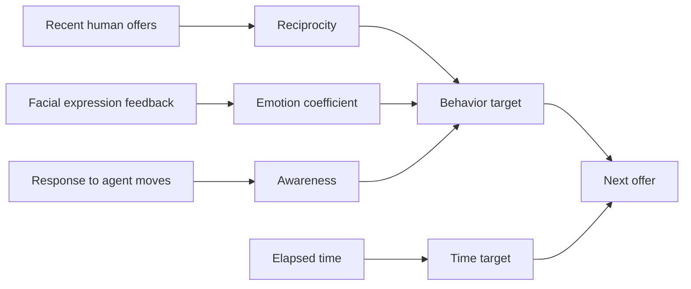

# Solver Agent: Towards Emotional and Opponent-Aware Agent for Human-Robot Negotiation — [AAMAS 2021]

Mehmet Onur Keskin · Umut Çakan · Reyhan Aydoğan

[Paper](https://www.ifaamas.org/Proceedings/aamas2021/pdfs/p1557.pdf) · [Explore the method](METHOD.md) · [Try the code](#try-it-yourself) · [Study guide](docs/protocol.md) · [Citation](#cite-the-paper)

[](https://github.com/monurkeskin/Solver-Agent-AAMAS-2021/actions/workflows/tests.yml)
[](https://doi.org/10.5281/zenodo.22729008)

**How should a negotiating robot respond when a person's offers and emotional expressions tell different stories?**

Solver brings emotional feedback into a negotiation strategy that already balances reciprocity and time pressure. Its key idea is **opponent awareness**: emotional signals influence the next offer according to how the human responds to the agent's changes in behavior.

## The idea

The agent starts from the utility of its previous offer, follows recent changes in the human's offers, and adds an emotion contribution. The awareness coefficient balances these two influences. A quadratic time component increases the role of the approaching deadline.



## In the paper

The AAMAS extended abstract introduces the Solver equation and explains the emotional and behavioral signals behind it. It is a compact method paper; the later [IVA 2025 study](https://github.com/monurkeskin/An-Adaptive-Emotion-Aware-Strategy-IVA-2025) develops and evaluates this line of work in a fuller experimental setting. [Read the paper](https://www.ifaamas.org/Proceedings/aamas2021/pdfs/p1557.pdf).

## Explore this work

Work through the Solver equation, vary synthetic offer histories and inspect the resulting targets. The fruit example is a convenient demonstration domain; the short paper does not specify a complete original experiment configuration.

| Explore | Start with | What it shows |
| --- | --- | --- |
| Equation checks | `reproduction/method.json` | Trace awareness, affect and reciprocal utility changes. |
| Example session | `configs/synthetic.json` | Inspect bids, decisions and a readable local report. |
| Historical scope | `METHOD.md` | Separate the published equation from later implementation choices. |

This repository holds the paper-specific configurations, method checks and study
guides. The shared [NEGOTIATOR framework](https://github.com/monurkeskin/NEGOTIATOR-IJCAI-2024) runs the negotiation,
participant/conductor views and session analysis. Its exact **2.0.0** revision is
pinned in [framework.json](framework.json); installation brings it in automatically.

The maintained `solver-2021` preset implements the published categorical equation. Its opponent model, offer selection and handling of earlier implementation details are recorded in [METHOD.md](METHOD.md) and the engine's method guide. It is not a frozen snapshot of the 2021 experiment software.

## Try it yourself

Use Python 3.11 or 3.12 and Git. This first example runs locally without a robot,
camera or service account.

```bash
git clone https://github.com/monurkeskin/Solver-Agent-AAMAS-2021.git
cd Solver-Agent-AAMAS-2021
python3 -m venv .venv
source .venv/bin/activate
python -m pip install -r requirements.txt
python run.py --output demo-output
```

On Windows, create the environment with `py -3 -m venv .venv` and activate it with
`.venv\Scripts\Activate.ps1` in PowerShell.

Open **`demo-output/report/index.html`** to follow the example negotiation. The
output includes offers, utility trajectories, session records and exportable
figures. These are synthetic examples for exploring the software and method.
[Installation help](docs/compatibility.md).

### Read a calculation or open the study workspace

```bash
negotiator reproduce reproduction/method.json --output method-output
negotiator gui
```

In **New study → Import a paper or study configuration**, select
`configs/synthetic.json` for the demonstration, or `configs/protocol-template.json`
to inspect the paper's protocol template. The [study guide](docs/protocol.md)
explains the remaining protocol/asset requirements and device setup.

## Data and reproducibility

Participant-level records and audio/video recordings are **not distributed in this
repository**. Restricted access is compatible with sharing the method, protocol and
analysis code; it does not require releasing human-study data publicly. The package
provides synthetic inputs and documents which computations can be run from them.
Recomputing the published human-study statistics additionally requires authorized
access to the relevant inputs and the corresponding analysis specification.

[Reproducibility guide](REPRODUCIBILITY.md) · [Paper-to-code map](paper-map.json) ·
[Analysis guide](docs/analysis.md)

## Build on the work

To change a paper condition, start with its configuration and add a small test
showing the intended behavior. Shared negotiation rules belong in NEGOTIATOR;
paper-specific profiles, protocols and result recipes belong here. The
[development guide](docs/development.md) walks through these boundaries and the
test-first workflow. [Contribution guide](CONTRIBUTING.md).

## Cite the paper

If you use this method or study design, please cite the associated paper:

```bibtex
@inproceedings{solveragent2021,
  title = {Solver Agent: Towards Emotional and Opponent-Aware Agent for Human-Robot Negotiation},
  author = {Keskin, Mehmet Onur and Çakan, Umut and Aydoğan, Reyhan},
  year = {2021},
  url = {https://www.ifaamas.org/Proceedings/aamas2021/pdfs/p1557.pdf}
}
```

The [citation file](CITATION.cff) provides the paper as the preferred citation.
For software provenance, also record the version and [archived 2.0.0 artifact](https://doi.org/10.5281/zenodo.22729008).
When using the shared engine in new research, cite the
[NEGOTIATOR framework paper](https://doi.org/10.24963/ijcai.2024/1012).
GPL-3.0-only; original contributors and sources are credited in [NOTICE](NOTICE).
